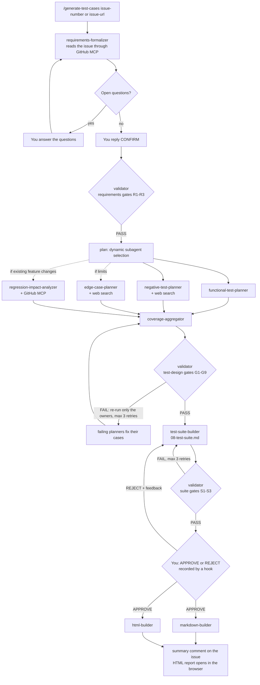

# AI QA Test Case Generator

An agentic workflow for [Claude Code](https://code.claude.com/docs) that turns a fictional Product Backlog Item (PBI), stored as a GitHub Issue, into a validated, human-approved QA test suite in Markdown and HTML.

You start it with one slash command:

```text
/generate-test-cases 19
```

The coordinator reads the issue through the GitHub MCP server, asks you about missing information, plans which specialist subagents to run, runs independent agents in parallel, checks every artifact against named quality gates with targeted retries, asks for your explicit approval, and only then writes the final documents. The workflow state is saved after every step, so an interrupted run continues where it stopped.

The workflow rules are documented in [CLAUDE.md](CLAUDE.md). This README explains how to set it up, run it, and resume it.

## Contents

- [How it works](#how-it-works)
- [Repository layout](#repository-layout)
- [Prerequisites](#prerequisites)
- [Setup](#setup)
- [Run the workflow](#run-the-workflow)
- [Approve or reject the draft](#approve-or-reject-the-draft)
- [Resume an interrupted run](#resume-an-interrupted-run)
- [Outputs](#outputs)
- [Quality gates and retries](#quality-gates-and-retries)
- [Hooks and deterministic approval](#hooks-and-deterministic-approval)
- [Sample runs in this repository](#sample-runs-in-this-repository)
- [Quick check for reviewers](#quick-check-for-reviewers)
- [Models and cost](#models-and-cost)
- [Secrets](#secrets)
- [Troubleshooting](#troubleshooting)
- [Definition of Done mapping](#definition-of-done-mapping)

## How it works



Solid arrows are sequential steps; the four planners and the two builders run in parallel. Dotted arrows are steps that are selected only when the execution profile requires them.

**Dynamic subagent selection.** `requirements-formalizer` writes an execution profile. The coordinator selects agents from it:

| Subagent | Runs when |
|---|---|
| `functional-test-planner`, `negative-test-planner` | always |
| `edge-case-planner` | the requirements contain limits, lengths, quantities, formats, dates, or times |
| `regression-impact-analyzer` | the PBI changes an existing feature |
| `markdown-builder` / `html-builder` | the output format you chose contains Markdown / HTML |
| summary comment on the issue | you agreed to it |

**External sources.** `negative-test-planner` and `edge-case-planner` use web search (for example OWASP cheat sheets, NIST, RFCs); every test case based on a standard links to its source, and the validator opens every link. The GitHub MCP server is used to read the PBI, to find related issues for regression analysis, and to post the summary comment.

## Repository layout

```text
.claude/
  commands/generate-test-cases.md   coordinator (slash command)
  agents/                           10 subagents, one responsibility each
  skills/
    test-case-template-formatter/   test case template, suite layout, HTML template
    traceability-checker/           AC <-> test case traceability and coverage checks
  hooks/
    approval-gate-guard.js          PreToolUse: blocks final output without a valid approval
    post-write-state.js             PostToolUse: records every written artifact (sha256) in the state
    approval-recorder.js            UserPromptSubmit: records APPROVE / REJECT deterministically
  lib/workflow-lib.js               shared code: step graph, sha256, file lock, atomic writes
  scripts/
    workflow-state.js               deterministic CLI the coordinator uses to change the state
    selftest-hooks.js               self-test of the hooks and the state script
    open-report.js                  opens the final HTML report in your browser
  settings.json                     hook registration and pre-approved permissions
.mcp.json                           GitHub MCP server (token read from an environment variable)
samples/pbi/                        fictional PBIs, mirrored as GitHub Issues
runs/<run-id>/                      saved workflow runs: input, artifacts, state, approval, output
CLAUDE.md                           workflow rules for Claude Code
```

## Prerequisites

| Requirement | Notes |
|---|---|
| [Claude Code](https://code.claude.com/docs) | CLI or the VS Code extension, with a Claude subscription or an Anthropic API key |
| [Node.js](https://nodejs.org) 18 or later | runs the hooks and scripts; only built-in modules are used, no `npm install` needed |
| [Git](https://git-scm.com) | on Windows, Git for Windows (Claude Code uses its Git Bash) |
| A GitHub account | to create the PBI issue and a personal access token |

The workflow was developed and run on Windows 11 with PowerShell and the Claude Code extension for VS Code; the scripts are cross-platform.

## Setup

### 1. Get the repository

Fork this repository on GitHub (recommended: you then have your own Issues) and clone your fork:

```bash
git clone https://github.com/<your-account>/ai-qa-test-case-generator.git
cd ai-qa-test-case-generator
```

### 2. Create a GitHub personal access token

1. Open <https://github.com/settings/personal-access-tokens/new> (fine-grained token).
2. **Repository access**: only select repositories, choose your fork.
3. **Repository permissions**: **Issues - Read and write**; **Metadata - Read-only** is added automatically.
4. Generate the token and copy it. Never paste it into any file of the repository.

### 3. Put the token into an environment variable

The variable name is `GITHUB_PERSONAL_ACCESS_TOKEN` (see [.env.example](.env.example)). Claude Code does not read `.env` files, so the variable must exist in the environment that starts Claude Code.

Windows (PowerShell), then **fully restart** VS Code or the terminal:

```powershell
setx GITHUB_PERSONAL_ACCESS_TOKEN "<your-token>"
```

macOS / Linux (add the line to `~/.bashrc` or `~/.zshrc` to keep it):

```bash
export GITHUB_PERSONAL_ACCESS_TOKEN="<your-token>"
```

Check it without printing the token:

```powershell
if ($env:GITHUB_PERSONAL_ACCESS_TOKEN) { "token is set" } else { "token is NOT set" }
```

### 4. Run the self-test

```bash
node .claude/scripts/selftest-hooks.js
```

Expected: `19 passed, 0 failed`. The test runs every hook and the state script on a temporary run and deletes it afterwards.

### 5. Start Claude Code in the repository root

Start Claude Code from the repository root (`claude` in a terminal, or open the folder in VS Code and open the Claude Code panel). If Claude Code asks whether to use the MCP server from `.mcp.json`, approve it. Then check:

```text
/mcp
```

Expected: `github` with status connected.

### 6. Create a PBI issue

Create an issue in your fork from one of the samples in [samples/pbi/](samples/pbi/): the first line of the file is the title, the rest is the body. For a quick check use [issue-19-newsletter-subscription.md](samples/pbi/issue-19-newsletter-subscription.md). Remember the issue number.

## Run the workflow

In Claude Code:

```text
/generate-test-cases <issue-number>
```

or with a full link, for example to a public issue of another repository:

```text
/generate-test-cases https://github.com/<owner>/<repo>/issues/<number>
```

What happens and what you do:

1. The coordinator prints the **run ID** (for example `issue-19-20260924-1530`). Write it down.
2. `requirements-formalizer` reads the issue and lists open questions with proposed defaults. Answer them in one message, for example: `Use defaults for all questions. Output format: markdown+html. Post the summary comment to the issue: yes.` Answer in English: your answers are copied into the artifacts.
3. The coordinator shows the acceptance criteria and the execution profile. Reply `CONFIRM`, or send corrections.
4. The coordinator shows the execution plan (which agents run and why) and runs the agents. This takes 15-40 minutes depending on the size of the PBI.
5. When the draft is ready, you are asked to approve it (next section).

The first time an agent writes into `runs/`, Claude Code may ask for permission; choose "Yes, allow all edits this session". The hooks still guard the protected files in every permission mode.

## Approve or reject the draft

Open `runs/<run-id>/artifacts/08-test-suite.md`, review it, and send **exactly one line** in Claude Code:

```text
APPROVE <run-id>
```

```text
REJECT <run-id>: <your feedback>
```

- The `approval-recorder` hook records the decision in `runs/<run-id>/approval.json` together with the sha256 of the draft you reviewed. The model never writes this file.
- Any other wording ("ok", "looks good") is not an approval.
- In the VS Code panel, text selected in the editor is attached to your message. Close the file or clear the selection before you send the decision, otherwise the message is not exactly one line and is not recorded (the coordinator tells you so).
- On `REJECT`, the feedback is saved as `09-review-feedback-rev-<n>.md`, the suite is revised (planners are re-run when new test cases are needed), validated again, and you are asked again.

## Resume an interrupted run

If Claude Code is closed, crashes, or you stop it during a run, start a new session and run:

```text
/generate-test-cases --resume <run-id>
```

The coordinator:

1. reads `runs/<run-id>/workflow-state.json`;
2. runs `node .claude/scripts/workflow-state.js verify <run-id>`, which compares every completed artifact with the sha256 recorded when it was written;
3. skips `completed` and `skipped` steps, re-runs steps that were `in_progress` when the run stopped, and continues with the `pending` ones;
4. re-runs a completed step together with its downstream steps if its artifact is missing or was changed by hand.

To look at a run's state yourself:

```bash
node .claude/scripts/workflow-state.js show <run-id>
```

## Outputs

Each run lives in `runs/<run-id>/`:

| Path | Content |
|---|---|
| `input/pbi.md` | the issue text as read through MCP |
| `artifacts/01-requirements.md` | formal requirements, clarifications, execution profile |
| `artifacts/02-...05-*.md` | test cases of each planner |
| `artifacts/06-coverage-matrix.md` | requirement to test case coverage |
| `artifacts/07-validation-<scope>-attempt-<n>.md` | one report per validation attempt |
| `artifacts/08-test-suite.md` | the draft submitted for approval |
| `artifacts/09-review-feedback-rev-<n>.md` | your feedback on a rejected revision |
| `approval.json` | the recorded decision (written by the hook) |
| `workflow-state.json` | step statuses with history, plan, gate results, retries, revisions, artifact registry |
| `output/test-suite.md`, `output/test-suite.html` | the approved final documents |

At the end of a run the HTML report opens in your default browser. To open it again:

```bash
node .claude/scripts/open-report.js <run-id>
```

Without a run ID the script opens the report of the most recently completed run.

## Quality gates and retries

| Scope | Gates | Examples |
|---|---|---|
| `requirements` | R1-R3 | every acceptance criterion is testable; no open questions; requirements confirmed; valid execution profile |
| `test-design` | G1-G9 | every AC covered; no orphan cases; all template fields; no duplicates; positive and negative case per AC; ID format; real source links; regression coverage; coverage matrix matches |
| `suite` | S1-S3 | every validated case exactly once; fixed document structure; every review comment addressed |

The validator names the owner agent of every failed gate. The coordinator re-runs only those agents and then regenerates the downstream artifacts (for example planner, then coverage matrix, then validation). Each scope allows at most 3 retries; after that the run stops with a clear report. Full rules: [CLAUDE.md](CLAUDE.md).

## Hooks and deterministic approval

| Hook | Event | Purpose |
|---|---|---|
| `approval-gate-guard` | PreToolUse | blocks every write to `runs/<run-id>/output/` unless `approval.json` says `approved` and its sha256 equals the current draft; blocks direct writes to `approval.json` and `workflow-state.json`, including through shell commands |
| `post-write-state` | PostToolUse | records every file written into a run (sha256, time, step, agent) in `workflow-state.json` |
| `approval-recorder` | UserPromptSubmit | turns your `APPROVE` / `REJECT` message into `approval.json`, only when the run is waiting for approval and the draft is exactly the version that was presented |

The hooks apply to subagents too. `.claude/settings.json` additionally denies edits of `approval.json` and `workflow-state.json`, so these files have two layers of protection. Any change to the draft after approval invalidates the approval.

## Sample runs in this repository

Four complete runs are stored in [runs/](runs/), each with its input, all artifacts, the approval record, the execution state, and the outputs.

| Run | PBI | What it demonstrates |
|---|---|---|
| [issue-7-20260923-2249](runs/issue-7-20260923-2249/) | [#7](https://github.com/MikitaZhyhadla/ai-qa-test-case-generator/issues/7) Password reset via email link | Complete happy path; two rounds of clarifying questions; security research (OWASP, NIST, RFC); `edge-case-planner` selected, `regression-impact-analyzer` skipped (new feature); targeted retry after G3/G4 (duplicates between planners); approval on the first revision; 103 test cases for 30 acceptance criteria. Executed before the model and budget optimization, therefore larger and slower. |
| [issue-8-20260924-0138](runs/issue-8-20260924-0138/) | [#8](https://github.com/MikitaZhyhadla/ai-qa-test-case-generator/issues/8) Promo code in the shopping cart | Incomplete PBI with 7 clarifying questions; change of an existing feature, so `regression-impact-analyzer` runs and uses the related issue [#10](https://github.com/MikitaZhyhadla/ai-qa-test-case-generator/issues/10) found through MCP; targeted retries in all three scopes (requirements 1, test-design 2, suite 1); 50 test cases including 8 regression cases. |
| [issue-9-20260924-1247](runs/issue-9-20260924-1247/) | [#9](https://github.com/MikitaZhyhadla/ai-qa-test-case-generator/issues/9) Appointment time-slot booking | Interruption during the parallel design step and `--resume` (see [interruption-snapshot.txt](runs/issue-9-20260924-1247/interruption-snapshot.txt) and the `restarted after resume` entries in the step history); validator caught an unreachable source link (G7); `REJECT` with two feedback items, revision, re-validation, and `APPROVE` of revision 4; an approval message with attached editor text was correctly not accepted. |
| [issue-19-20260924-1642](runs/issue-19-20260924-1642/) | [#19](https://github.com/MikitaZhyhadla/ai-qa-test-case-generator/issues/19) Newsletter subscription | Run from a clean checkout (a fresh clone without any local files), following this README; new feature with limits, so `edge-case-planner` runs and `regression-impact-analyzer` is skipped; targeted retry after G3/G4; approval on the first revision; 42 test cases. |

Note: some test data in run 1 intentionally contains Cyrillic letters (for example `пароль2026`). The confirmed requirements define a "letter" as a Latin letter only, so non-Latin letters are an equivalence class that must be tested.

## Quick check for reviewers

Three small PBIs are prepared for a fast end-to-end check (about 15-25 minutes each). Each one leads to a different execution plan:

| Issue | Sample file | Expected plan |
|---|---|---|
| [#19](https://github.com/MikitaZhyhadla/ai-qa-test-case-generator/issues/19) Newsletter subscription | [issue-19-newsletter-subscription.md](samples/pbi/issue-19-newsletter-subscription.md) | new feature with limits: functional, negative, edge cases; regression skipped |
| [#22](https://github.com/MikitaZhyhadla/ai-qa-test-case-generator/issues/22) Order number in the confirmation email | [issue-22-order-number-in-email.md](samples/pbi/issue-22-order-number-in-email.md) | change of an existing feature: functional, negative, regression (finds the related issue #10 through MCP); edge cases skipped |
| [#23](https://github.com/MikitaZhyhadla/ai-qa-test-case-generator/issues/23) Light and dark theme | [issue-23-dark-theme.md](samples/pbi/issue-23-dark-theme.md) | new feature without limits: only functional and negative; edge cases and regression skipped; one vague criterion triggers a clarifying question |

1. Complete the [Setup](#setup) and create issues in your fork from the sample files (the first line is the title, the rest is the body).
2. Run `/generate-test-cases <your-issue-number>`, answer the questions with defaults, `CONFIRM`, and `APPROVE <run-id>`.

Without a fork you can read the public issues of this repository by URL, for example `/generate-test-cases https://github.com/MikitaZhyhadla/ai-qa-test-case-generator/issues/19`. Answer `Post the summary comment to the issue: no`, because your token cannot write to this repository.

## Models and cost

- The coordinator runs on the model of your Claude Code session. Sonnet is enough for the coordinator; Opus is slower and uses more of your usage limit.
- Subagents choose their own model in `.claude/agents/*.md`: `sonnet` for planners, validator and builders, `haiku` for `markdown-builder`; mechanical agents use `effort: low`. Subagents skip `CLAUDE.md` (`omitClaudeMd: true`) because their instructions are self-contained.
- Planners have budgets for the number of test cases and web requests. A typical run produces 40-60 test cases.

## Secrets

- The only secret is the GitHub token. It is read from the `GITHUB_PERSONAL_ACCESS_TOKEN` environment variable by `.mcp.json` (`${GITHUB_PERSONAL_ACCESS_TOKEN}`) and is never written to a file.
- `.env`, `.env.*` (except `.env.example`), `.claude/settings.local.json`, and `CLAUDE.local.md` are ignored by git.
- `.claude/settings.json` denies reading `.env` files.

## Troubleshooting

| Problem | Fix |
|---|---|
| `/mcp` shows `github` as failed or `401` | The token is missing, expired, or has no access to the repository. Check the variable (Setup step 3) and restart VS Code or the terminal completely after `setx`. |
| The formalizer reports that the issue cannot be read | Wrong issue number, or the token is limited to another repository. |
| `APPROVE` is not accepted | Send exactly `APPROVE <run-id>` as the whole message, without attached editor selection. The run must be waiting for approval, and the draft must not have been changed after it was presented. |
| A write to `output/` is blocked by `approval-gate-guard` | Expected without a valid approval. Approve the current draft. |
| Hooks do not run after changing `.claude/settings.json` | Start a new Claude Code session; hooks are loaded at session start (`/hooks` lists them). |
| Many permission prompts during a run | Choose "Yes, allow all edits this session" on the first prompt, or run the coordinator in a mode that accepts edits. |
| A run stopped after 3 failed retries | Read the last `07-validation-*.md` report, fix the cause (for example unclear requirements), and start a new run. |
| The self-test fails | Check `node --version` (18 or later) and run it from the repository root. |

## Definition of Done mapping

| Requirement | Where |
|---|---|
| `CLAUDE.md` documents the workflow and its execution rules | [CLAUDE.md](CLAUDE.md) |
| At least 5 subagents and 1 coordinator | [.claude/agents/](.claude/agents/) (10 subagents), [.claude/commands/generate-test-cases.md](.claude/commands/generate-test-cases.md) |
| At least 2 reusable skills | [test-case-template-formatter](.claude/skills/test-case-template-formatter/SKILL.md), [traceability-checker](.claude/skills/traceability-checker/SKILL.md) |
| `PreToolUse` and `PostToolUse` hooks | [.claude/hooks/](.claude/hooks/), registered in [.claude/settings.json](.claude/settings.json) |
| At least one MCP server | GitHub MCP server in [.mcp.json](.mcp.json) |
| Everything version-controlled | this repository |
| At least 3 runs with inputs, artifacts, and state | [runs/](runs/), inputs in [samples/pbi/](samples/pbi/) |
| Setup, run, and resume instructions | this README |
| No secrets in the repository | [Secrets](#secrets), [.env.example](.env.example) |
| Runs from a clean checkout | [Setup](#setup), [self-test](#4-run-the-self-test) |
